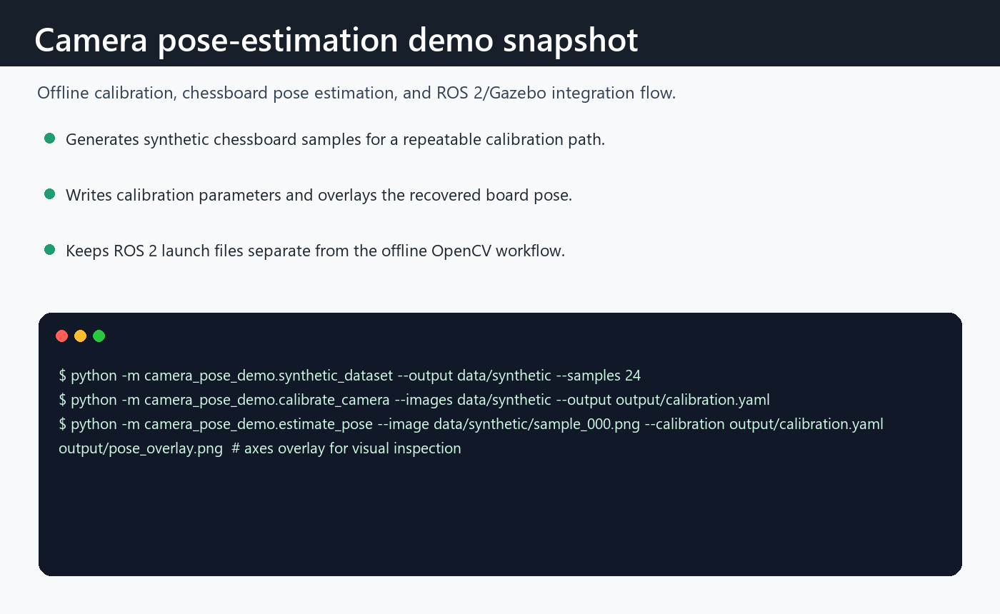

# Camera Calibration + Pose Estimation Demo

This repository contains a small end-to-end demo for camera calibration and
chessboard pose estimation, plus Gazebo Classic assets for testing the same
pipeline in simulation.

The demo has two modes:

- Offline OpenCV mode: generate synthetic chessboard images, calibrate a camera,
  and estimate the board pose from an image.
- ROS 2 + Gazebo mode: launch a simulated camera looking at a calibration target
  and publish a live `PoseStamped` estimate.

## Repository Layout

```text
camera_pose_demo/          OpenCV and ROS 2 Python package
config/board.yaml          Chessboard target definition
gazebo/                    World and calibration checkerboard model
launch/                    ROS 2 Gazebo launch file
urdf/                      Simulated camera rig
requirements.txt           Offline Python dependencies
```

## Offline workflow

Create a virtual environment and install the OpenCV dependencies:

```bash
python -m venv .venv
source .venv/bin/activate
pip install -r requirements.txt
```

Generate synthetic chessboard images:

```bash
python -m camera_pose_demo.synthetic_dataset --output data/synthetic --samples 24
```

Calibrate the camera:

```bash
python -m camera_pose_demo.calibrate_camera \
  --images "data/synthetic/*.png" \
  --output output/calibration.yaml
```

Estimate pose for one frame and save an annotated overlay:

```bash
python -m camera_pose_demo.estimate_pose \
  --image data/synthetic/frame_000.png \
  --calibration output/calibration.yaml \
  --output output/pose_overlay.png
```

The pose command prints translation, rotation vector, and camera-frame Euler
angles as JSON.

## ROS 2 + Gazebo workflow

This launch file targets ROS 2 with Gazebo Classic and `gazebo_ros`.

```bash
colcon build --packages-select camera_pose_demo
source install/setup.bash
ros2 launch camera_pose_demo gazebo_camera_pose_demo.launch.py
```

Expected topics:

- `/demo/camera/image_raw`
- `/demo/camera/camera_info`
- `/camera_pose_demo/board_pose`
- `/camera_pose_demo/debug_image`

The Gazebo world places a vertical checkerboard target in front of a fixed
camera rig. The ROS node estimates the chessboard pose using the simulated
camera image and camera info.

## Notes

- The checkerboard target is configured in `config/board.yaml`.
- The default target has 9 x 6 inner corners with 0.04 m square spacing.
- Gazebo support is included as project assets. It requires a Linux ROS/Gazebo
  environment; the offline OpenCV tools can be run independently.

## Calibration output



Offline command flow for synthetic calibration and chessboard pose overlay generation.


## Pose-estimation notes

- End-to-end camera calibration and pose estimation as a ROS 2-friendly Python package.
- Separation between offline OpenCV utilities and simulation launch assets.
- A repeatable synthetic-data path for testing the calibration workflow without a physical camera.


## Camera validation notes

- The strongest demo path still assumes OpenCV and, for simulation, a ROS 2/Gazebo environment.
- Synthetic samples do not replace real lens distortion and lighting variation.
- Next steps: add recorded real-camera samples and publish a short Gazebo run capture.

